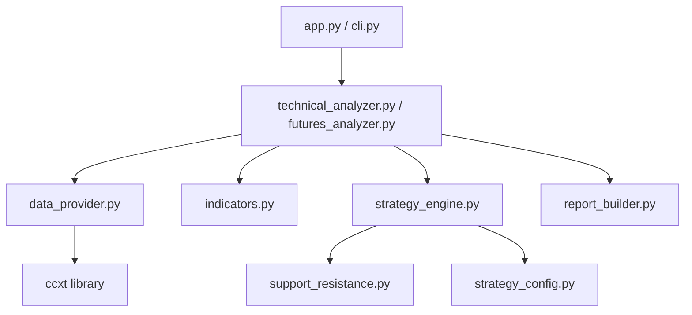
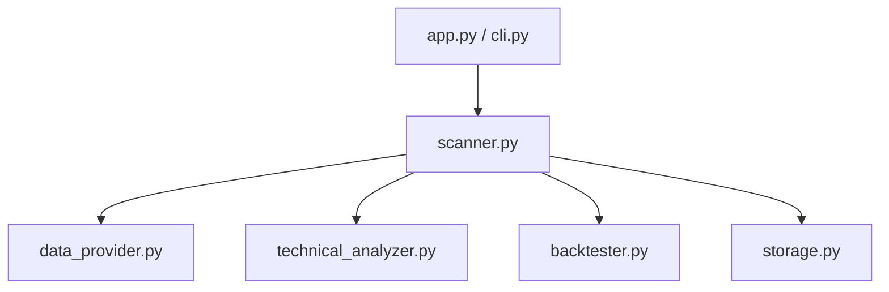
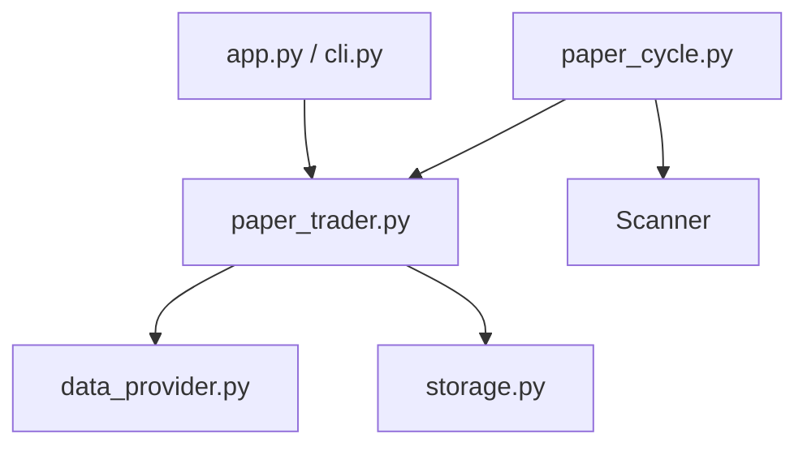
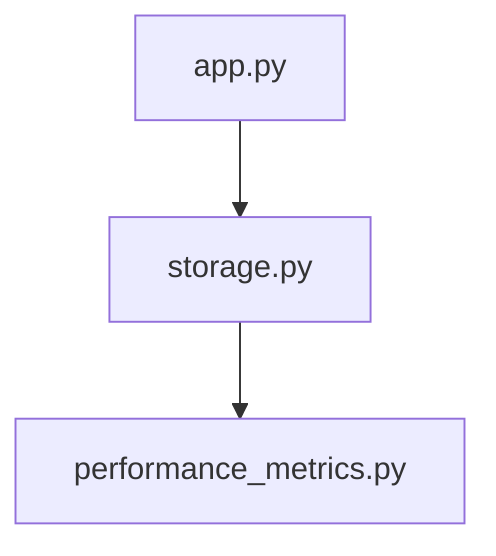
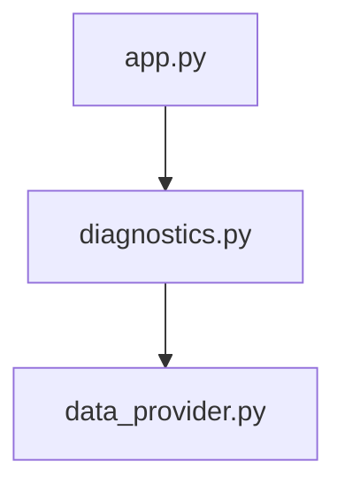

# Function Flow Map

## 1. Flujo Analyze (Spot/Futures)
Este flujo se activa desde la UI o CLI para analizar un símbolo específico.

## 2. Flujo Scanner (Masivo)
Escaneo de múltiples pares para encontrar candidatos.

## 3. Flujo Paper Trading (Simulación)
Mantenimiento de posiciones simuladas.

## 4. Flujo Dashboard & Performance
Visualización de resultados históricos.

## 5. Flujo Diagnostics
Verificación de conectividad y entorno.

